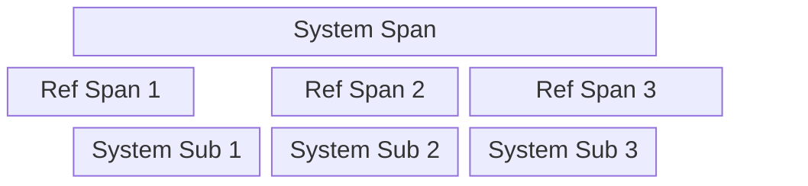

# Evaluation
This directory contains code to evaluate methods for detecting (and identifying)
poetry excerpts.

## Terminology
In this setting, we assume we have two sets of annotations: a *reference* set and
a *system* set. In the typical scenario, we are evaluating some system's results
against some baseline annotations serving as a sort of "ground truth". This lets
us ask how well the system identifies poetry excerpts compared to this baseline
(e.g., how many does it miss? how many unexpected excerpts does it flag?). That
said, we can use the same code to compare the agreement of two sets of annotations
(produced by humans or computers).

## Evaluation Dataset
In order to evaluate computational methods for detecting poetry excerpts, we
built a small evaluation dataset to use as our reference set. For a small subset of
adjudicated spans from our annotation task, we manually identified the poems and
constructed a `.JSONL` file containing these annotations to use for evaluation.

## Page-level Span Evaluation Method
We compare the poetry span annotations produced at the page level calculating page-level
precision and recall scores. Our approach builds off existing methods for evaluation span
annotations but makes design choices suitable to our task.

### Assumptions
**Spans.** In this setting a span to have the following three components:
- start: Start index of the span
- end: End index of the span
- label: The ID of the referenced poem

Note that a span's interval is Pythonic [closed, open) interval.

**Reference Spans.** We assume that a reference's spans do not overlap. Either the entire span
is an excerpt from a poem or it is not. Note that our method can generally accomodate overlapping
spans if they have different labels (i.e., one poem reuses a line from yet another poem), but only
if poem labels are taken into account.

**System Spans.** Unlike reference spans, system spans are permitted to overlap. This can easily
happen in the case of passim where overlapping passages can be identified for different lines of
the same reference poem.

### Span Overlap Factor
Taking inspiration from Stanislav Olenchenko's [blog post](https://blog.p1k.org/yet-another-way-of-ner-systems-evaluation/),
we define the overlap factor between two spans $a$ and $b$ *with the same poem label* to be equal to
the proportion of the overlap of their intervals with respect to the larger span.

$$
overlap\textunderscore factor(a, b) = \frac{\min(a_{end}, b_{end}) - \max(a_{start}, b_{start})}{\max(a_{end}-a_{start}, b_{end}-b_{start})}
$$

### Step 1. Map reference spans to viable system spans
In this first step, we take inspiration from ACE NER evaluation metrics (see Hal Daume's [blog post comment](https://nlpers.blogspot.com/2006/08/doing-named-entity-recognition-dont.html?showComment=1156981200000#c115698122985619877)). We effectively build a bipartite graph linking
each reference span to the "best" matching system span. Currently, we determine the best matching
system span for each reference span independently. For each reference span, we select the
system span with the greatest overlap factor. This may result multiple reference spans linking to
the same system span.

Note that this selection process will greatly penalize systems that separate a poem excerpt into
multiple spans.

### Step 2. Determine Reference-"System" Span Pairs
To calculate precision and recall scores, we must have one-to-one style mappings between reference
and system spans. This is straightforward from our reference-system span mapping if each system
span is linked with at most one reference span. However, if $k$ reference spans map to a
single system span, we'll need to split the system span into $k$ distinct subspans.

#### Splitting System Spans
For reference spans $r_0 \dots r_k$ mapping to a single system span $s$, we split $s$ into the following
$k$ sub-spans using of the starting index of all but the first reference span:

$$
\left(s_{start}, r_{1_{start}} \right),
\left(r_{1_{start}}, r_{2_{start}} \right),
\cdots,
\left(r_{k_{start}}, s_{end} \right)
$$




**Example.**


If we have the following four reference spans $(394, 512), (516, 557), (563, 633), (637, 675)$ mapped
to the system span $(389, 678)$, this will result in the following working reference-system span pairs:

| Reference | System |
| --- | --- |
| (394, 512) | (389, 516) |
| (516, 557) | (516, 563) |
| (563, 633) | (563, 637) |
| (637, 675) | (637, 678) |

### Step 3. Calculating Precision and Recall
To calculate the precision and recall for each page, we first must determine the effective number of
relevant items retrieved by the system. If a system span is split into subspans in the previous step,
each of these subspans is considered a separate item. Like in Stanislav Olenchenko's [blog post](https://blog.p1k.org/yet-another-way-of-ner-systems-evaluation/),
our relevance score is the sum of the relevance score for each reference-system span pair in our working
set. If the pair is an exact match, its relevance score is 1; if it is a partial match, it is equivalent
to its overlap factor. Optionally, the contributions of partial matches can be further penalized with
a penalty weight $w$. By default, we do not penalize partial matches (i.e., $w=1$)

$$ relevance\textunderscore score = n\textunderscore exact + w\cdot\sum_{partial} overlap\textunderscore factor(r_i, s_i)$$

**Precision.**
The precision for a page is simply the page's relevance score divided by the effective number of
system spans. The effective number of system spans incorporates the number of paired system (sub)spans
as well as any unpaired system spans.

$$ Precision = \frac{relevance\textunderscore score}{\text{\\# working system spans}} $$

**Recall.**
The relevance for a page is simply the page's relevance score divided by the numer of reference spans
(i.e. the number of relevant items).

$$ Recall = \frac{relevance\textunderscore score}{\text{\\# reference spans}} $$

**Edge Cases.**
If a page has no relevant items (i.e. the page contains no poem excerpts), precision is equal to 1
if there are no system spans for the page, otherwise 0. Likewise, if a system produces no system
spans for a page (i.e., the system identifies no poem excerpts within the page), recall is equal to 1
if the page has no poem excerpts (i.e., there are no reference spans for this page), and 0 otherwise.

## Ignoring Poem Labels
Optionally, poem labels can be ignored. This turns the task from identifying particular poems instead to
identifying poetry excerpts more generally. In this setting, it makes little sense for our systems span
sets to contain overlapping spans. So, as a prestep in this case, overlapping system spans are combined
into one contiguous span. Then, our evaluation method proceeds as normal.

## Script Details
The script `evaluate_poetry_spans` generates page-level evaluation scores for input reference and system
span annotation (`.JSONL`) files. Results are written to an output `.CSV` file.

**Required parameters.**
- `reference_jsonl`: Path to reference poetry span annotations (JSONL file)
- `system_jsonl`: Path to system span annotations to be evaluated (JSONL file)
- `output_file`: Filename where results should be written (CSV file)

**Optional parameters.**
- `ignore-label`: Ignore span labels for span evaluations
- `partial-match-weight`: Downweight for partial matches for span evaluations (default: 1.0)

**Output.**
Currently, the output `.CSV` file includes the following fields with each row corresponding to a page:
- page_id: PPA page ID
- precision: precision score
- recall: recall score
- n_span_matches: number of (partial and exact) span matches
- n_span_misses: number of span misses
- n_span_spurious: number of spurious system spans
- n_poem_matches: number of correctly identified poems
- n_poem_misses: number of missed poems
- n_poem_spurious: number of spuriously identified poems

**Examples.**
```
python evaluate_poetry_spans.py ref_spans.jsonl system_spans.jsonl eval_results.csv
python evaluate_poetry_spans.py adjudicated_spans.jsonl passim_spans.jsonl eval_results.csv
```
